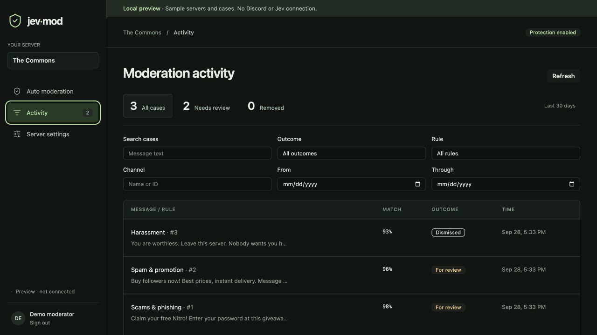

# Jev-Mod

Open-source Discord moderation, powered by TypeSafe Jev.

[Website](https://undeemed.github.io/jev-mod/) · [Dashboard](https://jev-mod.jerry-2c0.workers.dev) · [Add to Discord](https://discord.com/oauth2/authorize?client_id=1554338188708020294&scope=bot%20applications.commands&permissions=1099511704576&integration_type=0) · [Documentation](docs/guide.md)


*Preview with sample data.*

## Get started

1. **Sign in** to the dashboard with Discord.
2. **Add Jev-Mod** to a server where you have **Manage Server** permission.
3. **Add your TypeSafe key** under Server settings → API key.
4. **Set your rules**, test in Monitor only mode, then enable Protect server.

No bot token or hosting account needed for the hosted service.

## Moderation

| Control | What it does |
| --- | --- |
| AI rules | Detect spam, phishing, harassment, hate, threats, and explicit sexual text. |
| Actions | Log matches, delete messages, or delete and apply a timeout. |
| Local filters | Block phrases and limit mentions without AI. |
| Exceptions | Search channels and roles that bypass automatic rules. |
| Activity | Search, filter, and review recorded cases. |
| Commands | Use `/jevmod status` and `/jevmod pause`. |

[Rule behavior and enforcement limits →](docs/guide.md#moderation)

## Self-host

| Platform | Setup |
| --- | --- |
| Docker Compose | [Run on your own VPS with SQLite](docs/self-hosting.md) |
| Cloudflare | [Worker, D1, and Container setup](docs/guide.md#cloudflare-setup) |

### Cloudflare setup

Follow the [operator guide](docs/guide.md#cloudflare-setup) for credentials, migrations, and deployment.

## Website deployment

The landing page is static HTML/CSS in `docs/`; `.nojekyll` disables Jekyll.

1. Merge the site files into `main`.
2. In [GitHub Pages settings](https://docs.github.com/en/pages/getting-started-with-github-pages/configuring-a-publishing-source-for-your-github-pages-site), select **Deploy from a branch**, **main**, **/docs**, then **Save**.
3. After deployment, verify the [public website](https://undeemed.github.io/jev-mod/), its images, favicon, links, and README rendering on GitHub.

GitHub runs its own Pages deployment; no custom CI workflow is needed.
Keep the dashboard on Cloudflare and its `PUBLIC_URL` unchanged.

## Local preview

Requires Node.js **26.7+** and pnpm **10.33.2**.

```sh
git clone https://github.com/undeemed/jev-mod.git
cd jev-mod
pnpm install --frozen-lockfile
pnpm dev:setup
pnpm dev
```

Open **http://localhost:3102**.
Preview uses sample data; no Discord or Jev connection.

## Stack

React · TanStack Router · DaisyUI · Hono · Better Auth · Drizzle · Effect 3 · discord.js

[Architecture and runtime details →](docs/guide.md#stack)

## Runtime and data

- Each server gets separate settings, cases, and encrypted API-key storage.
- Enabled AI rules send message text to TypeSafe; flagged evidence expires after 30 days.
- For key-free local filters, disable all Jev rules.
- Moderation acts after messages are posted; attachments are not scanned.

[Data handling, health checks, and limits →](docs/guide.md#runtime-and-data)

## Contribute

```sh
pnpm test
pnpm check
```

[Report an issue](https://github.com/undeemed/jev-mod/issues) · [Verification guide](docs/verification.md) · [OSS research](docs/oss-moderation-research.md)

Keep keys, tokens, and private messages out of public reports.

**MIT licensed.** See [LICENSE](LICENSE) and [third-party notices](THIRD_PARTY_NOTICES.md).
